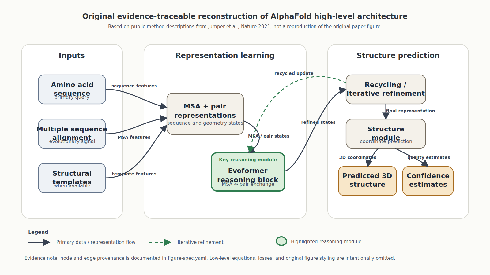

# Academic Figure Engineer

A reusable OpenClaw/LobsterAI skill for turning papers, code, equations, and research notes into publication-quality editable SVG academic figures.

## 中文介绍

Academic Figure Engineer 是一个面向学术论文和科研项目的图示生成 Skill，目标是把论文、方法章节、代码、公式、实验流程或粗略研究笔记，转化为可编辑的高质量 SVG 学术图。它适合用于模型架构图、研究框架图、算法流程图、预测-优化-控制闭环图、多时间尺度系统图、交通-能源耦合机制图、实验验证框架图和 graphical abstract。

这个 Skill 的核心原则不是“画得花哨”，而是优先保证科学逻辑正确、信息层级清晰、箭头关系真实、图形元素可编辑，并尽量满足期刊论文在单栏或双栏宽度下的可读性要求。它会先重构研究逻辑和图示规格，再生成 SVG 图，而不是直接堆砌视觉元素。


## Featured example



This flagship example is an original SVG reconstruction based on the public method description of Jumper et al., *Nature* 2021. It demonstrates evidence traceability: every major node and arrow is linked to a source statement in `examples/alphafold-nature-2021/figure-spec.yaml`. It does not reproduce the original paper figure.

## What it does

Academic Figure Engineer helps an agent:

1. reconstruct the scientific logic of a paper or project;
2. choose the right figure type;
3. build a structured figure specification;
4. generate editable SVG figures;
5. validate scientific correctness and visual readability;
6. produce captions and optional preview/export files.

The skill is designed for academic figures where correctness, hierarchy, and editability matter more than decorative visuals.

## Main output

- editable SVG architecture diagram;
- optional HTML preview;
- figure specification;
- publication caption;
- visual and scientific validation notes;
- optional PNG/PDF exports when the environment supports conversion.

Default generated files should be kept together under:

```text
outputs/academic_figures/
```

## Typical triggers

- Draw the architecture of this paper.
- Turn this method section into a publication-quality figure.
- Create an SVG model diagram from this code.
- Design a traffic-energy coupling framework figure.
- Convert this algorithm into a one-page academic workflow diagram.
- Redesign this figure so it is suitable for a journal paper.
- Make a bilingual Chinese-English figure caption and keep terminology consistent.

## Included references

```text
references/figure-types.md              # common academic figure types
references/svg-rules.md                 # SVG construction and editability rules
references/journal-style-presets.md     # Nature/Science, Elsevier, IEEE, graphical abstract presets
references/final-quality-checklist.md   # scientific + visual validation checklist
references/evidence-traceability.md       # source tracking for nodes and arrows
references/bilingual-labeling.md        # Chinese-English label and caption rules
templates/figure-spec.yaml              # reusable figure specification template
```

## Examples

```text
examples/model-architecture/
examples/traffic-energy-framework/
examples/algorithm-workflow/
```

Each example describes the input summary, central message, recommended figure type, layout, and cautions.

## Design principles

- Scientific correctness first.
- One figure should communicate one central message.
- Every arrow must represent a real relationship.
- Do not invent modules, equations, datasets, losses, constraints, or optimization stages.
- Keep text editable as SVG text.
- Avoid generic AI-style decoration.
- Preserve readability at single-column or double-column journal widths.
- Make the proposed contribution visible but not exaggerated.

## Recommended installation

Copy the `academic-figure-engineer` directory into your local skills directory. Keep `SKILL.md` at the root of the skill directory.

Example:

```bash
cp -R academic-figure-engineer "$HOME/Library/Application Support/LobsterAI/SKILLs/"
```


## Author and license

Created and maintained by **w0001111**.

Repository:

```text
https://github.com/w0001111/academic-figure-engineer
```

Copyright (c) 2026 w0001111.

Released under the MIT License. If you use, adapt, or redistribute this skill, please retain the original copyright notice, license text, and attribution to this repository.

## Safety profile

This skill is text-only. It does not require network access, credentials, package installation, or system-level permissions. It should only read files provided by the user or clearly required for the requested figure task.
